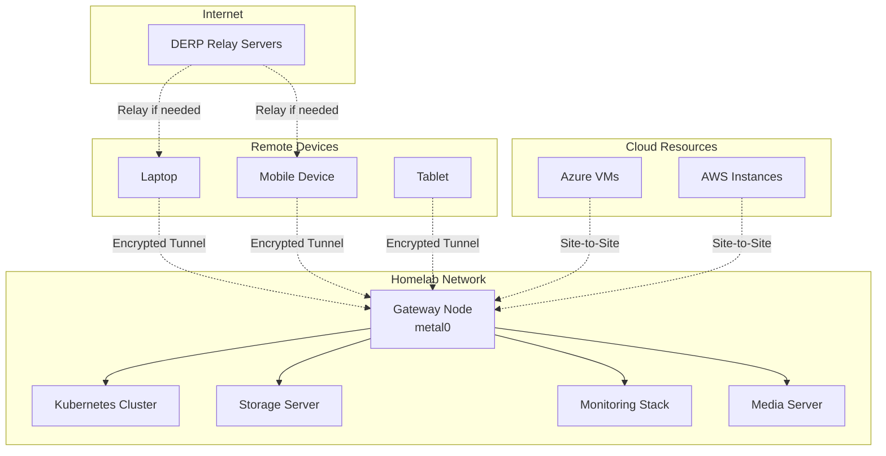

# Enterprise Tailscale Homelab Configuration

!!! info "Zero-Trust Mesh VPN for Homelab"
    This guide covers implementing Tailscale as an enterprise-grade mesh VPN solution for secure homelab access, including advanced security configurations, monitoring, and integration strategies.

## Overview

Tailscale provides a modern, zero-trust mesh VPN solution that eliminates the complexity of traditional VPN configurations while providing enterprise-grade security. Unlike traditional hub-and-spoke VPNs, Tailscale creates direct peer-to-peer connections between devices, reducing latency and improving performance.

### Key Advantages

=== "Zero-Trust Security"

    **Modern Security Architecture**

    - **WireGuard-based encryption**: Industry-leading cryptographic protocols
    - **Identity-based access control**: Integration with SSO providers
    - **Device authentication**: Certificate-based device verification
    - **Network segmentation**: Granular access controls and ACLs

=== "Operational Simplicity"

    **Simplified Management**

    - **No port forwarding**: Eliminates firewall complexity
    - **Automatic key rotation**: Seamless security maintenance
    - **Cross-platform support**: Consistent experience across all devices
    - **Centralized management**: Web-based admin console

=== "Enterprise Features"

    **Business-Grade Capabilities**

    - **SSO integration**: SAML, OIDC, and Active Directory support
    - **Audit logging**: Comprehensive connection and access logs
    - **Device management**: Centralized device approval and revocation
    - **Network policies**: Fine-grained access control rules

## Architecture and Design

### Network Topology



### Security Zones

```yaml
Network Segmentation:
  DMZ Zone:
    - Public-facing services (with Funnel)
    - Web applications
    - Reverse proxy endpoints

  Internal Zone:
    - Management interfaces
    - Database servers
    - Internal APIs

  Restricted Zone:
    - Backup systems
    - Security tools
    - Administrative interfaces
```

## Initial Setup and Configuration

### Prerequisites

**System Requirements:**
- **Linux server** (Ubuntu 22.04 LTS recommended)
- **Static IP address** or DDNS configuration
- **Firewall access** for UDP port 41641
- **Domain name** (optional, for custom HTTPS certificates)

**Account Setup:**
1. Create Tailscale account at [tailscale.com](https://tailscale.com)
2. Choose appropriate plan (Personal, Premium, or Enterprise)
3. Configure SSO integration (if using enterprise features)

### Gateway Node Installation

Install Tailscale on your primary homelab server:

```bash
# Install Tailscale (Ubuntu/Debian)
curl -fsSL https://tailscale.com/install.sh | sh

# Authenticate and connect
sudo tailscale up --advertise-routes=192.168.1.0/24 --accept-routes

# Enable IP forwarding
echo 'net.ipv4.ip_forward = 1' | sudo tee -a /etc/sysctl.conf
echo 'net.ipv6.conf.all.forwarding = 1' | sudo tee -a /etc/sysctl.conf
sudo sysctl -p

# Configure as subnet router
sudo tailscale up --advertise-routes=192.168.1.0/24 --accept-dns=false
```

### Advanced Configuration

#### Custom DERP Servers

For enhanced performance and control, deploy custom DERP relay servers:

```yaml
# derp.yaml
regions:
  900:
    regionid: 900
    regioncode: "homelab"
    regionname: "Homelab DERP"
    nodes:
      - name: "homelab-derp"
        regionid: 900
        hostname: "derp.yourdomain.com"
        ipv4: "203.0.113.1"
        derp_port: 443
        stun_port: 3478
```

```bash
# Deploy DERP server
docker run -d \
  --name tailscale-derp \
  --restart unless-stopped \
  -p 443:443 \
  -p 3478:3478/udp \
  -v /opt/derp:/data \
  -e DERP_HOSTNAME=derp.yourdomain.com \
  -e DERP_CERT_MODE=letsencrypt \
  tailscale/derp:latest
```

#### Access Control Lists (ACLs)

Implement granular network policies:

```json
{
  "tagOwners": {
    "tag:server": ["admin@yourdomain.com"],
    "tag:client": ["admin@yourdomain.com"],
    "tag:restricted": ["admin@yourdomain.com"]
  },

  "groups": {
    "group:admin": ["admin@yourdomain.com"],
    "group:users": ["user1@yourdomain.com", "user2@yourdomain.com"],
    "group:readonly": ["readonly@yourdomain.com"]
  },

  "acls": [
    {
      "action": "accept",
      "src": ["group:admin"],
      "dst": ["*:*"]
    },
    {
      "action": "accept",
      "src": ["group:users"],
      "dst": ["tag:server:80,443,22"]
    },
    {
      "action": "accept",
      "src": ["group:readonly"],
      "dst": ["tag:server:80,443"]
    }
  ],

  "ssh": [
    {
      "action": "accept",
      "src": ["group:admin"],
      "dst": ["tag:server"],
      "users": ["root", "ubuntu"]
    }
  ]
}
```

## Service Exposure and Security

### Tailscale Funnel Configuration

Securely expose services to the internet:

```bash
# Enable HTTPS for specific services
sudo tailscale funnel --bg --https=443 --set-path=/jellyfin http://localhost:8096
sudo tailscale funnel --bg --https=443 --set-path=/grafana http://localhost:3000
sudo tailscale funnel --bg --https=443 --set-path=/prometheus http://localhost:9090

# Verify funnel status
sudo tailscale funnel status
```

### Service-Specific Configurations

=== "Media Server (Jellyfin)"

    **Secure Media Streaming**

    ```bash
    # Configure Jellyfin with Tailscale
    sudo tailscale funnel --bg --https=443 --set-path=/media http://localhost:8096

    # Configure reverse proxy headers
    cat > /etc/nginx/sites-available/jellyfin-tailscale << 'EOF'
    server {
        listen 8096;
        server_name localhost;

        location / {
            proxy_pass http://127.0.0.1:8920;
            proxy_set_header Host $host;
            proxy_set_header X-Real-IP $remote_addr;
            proxy_set_header X-Forwarded-For $proxy_add_x_forwarded_for;
            proxy_set_header X-Forwarded-Proto $scheme;
            proxy_set_header X-Forwarded-Host $server_name;
        }
    }
    EOF
    ```

=== "Monitoring Stack"

    **Secure Metrics Access**

    ```bash
    # Expose Grafana securely
    sudo tailscale funnel --bg --https=443 --set-path=/grafana http://localhost:3000

    # Configure Grafana for Tailscale
    cat > /etc/grafana/grafana.ini << 'EOF'
    [server]
    domain = your-tailscale-hostname.ts.net
    root_url = https://your-tailscale-hostname.ts.net/grafana/
    serve_from_sub_path = true

    [security]
    cookie_secure = true
    cookie_samesite = strict
    EOF
    ```

=== "Development Services"

    **Secure Development Access**

    ```bash
    # Expose development services
    sudo tailscale serve --bg --https=443 --set-path=/api http://localhost:8080
    sudo tailscale serve --bg --https=443 --set-path=/docs http://localhost:8000

    # Configure development environment
    export TAILSCALE_HOSTNAME=$(tailscale status --json | jq -r '.Self.DNSName')
    export API_BASE_URL="https://${TAILSCALE_HOSTNAME}/api"
    ```

## Advanced Security Configuration

### Multi-Factor Authentication

Enable MFA for enhanced security:

```bash
# Configure MFA requirement
tailscale up --operator=$USER --accept-routes --advertise-routes=192.168.1.0/24

# Set up hardware security keys
tailscale web # Access admin console to configure FIDO2/WebAuthn
```

### Device Management

Implement comprehensive device management:

```bash
# List all devices
tailscale status --json | jq '.Peer[] | {name: .DNSName, ip: .TailscaleIPs[0], lastSeen: .LastSeen}'

# Approve/reject devices programmatically
curl -X POST "https://api.tailscale.com/api/v2/device/${DEVICE_ID}/authorized" \
  -H "Authorization: Bearer ${TAILSCALE_API_KEY}" \
  -H "Content-Type: application/json" \
  -d '{"authorized": true}'

# Set device expiry
curl -X POST "https://api.tailscale.com/api/v2/device/${DEVICE_ID}/expire" \
  -H "Authorization: Bearer ${TAILSCALE_API_KEY}"
```

### Network Monitoring

Implement comprehensive monitoring:

```bash
# Monitor Tailscale connections
#!/bin/bash
# tailscale-monitor.sh

while true; do
    TIMESTAMP=$(date '+%Y-%m-%d %H:%M:%S')
    STATUS=$(tailscale status --json)

    # Extract key metrics
    PEER_COUNT=$(echo "$STATUS" | jq '.Peer | length')
    SELF_IP=$(echo "$STATUS" | jq -r '.Self.TailscaleIPs[0]')

    # Log to monitoring system
    echo "$TIMESTAMP - Peers: $PEER_COUNT, Self IP: $SELF_IP" >> /var/log/tailscale-monitor.log

    # Send metrics to Prometheus
    curl -X POST http://localhost:9091/metrics/job/tailscale/instance/homelab \
      --data-binary "tailscale_peer_count $PEER_COUNT"

    sleep 60
done

## Integration with Homelab Services

### Kubernetes Integration

Deploy Tailscale operator in Kubernetes:

```yaml
# tailscale-operator.yaml
apiVersion: v1
kind: Secret
metadata:
  name: operator-oauth
  namespace: tailscale
type: Opaque
stringData:
  client_id: "your-oauth-client-id"
  client_secret: "your-oauth-client-secret"
---
apiVersion: apps/v1
kind: Deployment
metadata:
  name: tailscale-operator
  namespace: tailscale
spec:
  replicas: 1
  selector:
    matchLabels:
      app: tailscale-operator
  template:
    metadata:
      labels:
        app: tailscale-operator
    spec:
      containers:
      - name: operator
        image: tailscale/k8s-operator:latest
        env:
        - name: OPERATOR_HOSTNAME
          value: "k8s-operator"
        - name: OPERATOR_SECRET
          value: "operator-oauth"
        - name: OPERATOR_LOGGING
          value: "info"
```

```bash
# Deploy the operator
kubectl apply -f tailscale-operator.yaml

# Expose services via Tailscale
kubectl annotate service my-service tailscale.com/expose="true"
kubectl annotate service my-service tailscale.com/hostname="my-service"
```

### Docker Integration

Configure Tailscale for containerized services:

```yaml
# docker-compose.yml
version: '3.8'
services:
  tailscale:
    image: tailscale/tailscale:latest
    container_name: tailscale-gateway
    hostname: homelab-gateway
    environment:
      - TS_AUTHKEY=${TAILSCALE_AUTHKEY}
      - TS_ROUTES=192.168.1.0/24
      - TS_EXTRA_ARGS=--advertise-routes=192.168.1.0/24 --accept-routes
    volumes:
      - /var/lib/tailscale:/var/lib/tailscale
      - /dev/net/tun:/dev/net/tun
    cap_add:
      - NET_ADMIN
      - SYS_MODULE
    sysctls:
      - net.ipv4.ip_forward=1
      - net.ipv6.conf.all.forwarding=1
    restart: unless-stopped

  nginx-proxy:
    image: nginx:alpine
    container_name: nginx-proxy
    depends_on:
      - tailscale
    network_mode: "service:tailscale"
    volumes:
      - ./nginx.conf:/etc/nginx/nginx.conf:ro
    restart: unless-stopped
```

### Prometheus Monitoring Integration

Monitor Tailscale metrics with Prometheus:

```yaml
# prometheus-tailscale.yml
global:
  scrape_interval: 15s

scrape_configs:
  - job_name: 'tailscale'
    static_configs:
      - targets: ['localhost:9090']
    metrics_path: '/metrics'
    scrape_interval: 30s

  - job_name: 'tailscale-node-exporter'
    tailscale_sd_configs:
      - server: 'https://api.tailscale.com'
        token: 'your-api-token'
    relabel_configs:
      - source_labels: [__meta_tailscale_device_hostname]
        target_label: instance
      - source_labels: [__meta_tailscale_device_os]
        target_label: os
```

```bash
# Custom Tailscale metrics exporter
#!/bin/bash
# tailscale-exporter.sh

cat > /tmp/tailscale-metrics.prom << 'EOF'
# HELP tailscale_peer_count Number of connected Tailscale peers
# TYPE tailscale_peer_count gauge
tailscale_peer_count{instance="homelab"} $(tailscale status --json | jq '.Peer | length')

# HELP tailscale_connection_latency Connection latency to peers in milliseconds
# TYPE tailscale_connection_latency gauge
EOF

# Add per-peer latency metrics
tailscale ping --json $(tailscale status --json | jq -r '.Peer[].TailscaleIPs[0]') 2>/dev/null | \
  jq -r '"tailscale_connection_latency{peer=\"" + .peer + "\",instance=\"homelab\"} " + (.latency_ms | tostring)' >> /tmp/tailscale-metrics.prom

# Serve metrics
python3 -m http.server 9100 --directory /tmp &
```

## Backup and Disaster Recovery

### Configuration Backup

Automate Tailscale configuration backups:

```bash
#!/bin/bash
# backup-tailscale-config.sh

BACKUP_DIR="/opt/backups/tailscale"
TIMESTAMP=$(date +%Y%m%d_%H%M%S)

mkdir -p "$BACKUP_DIR"

# Backup Tailscale state
sudo cp -r /var/lib/tailscale "$BACKUP_DIR/tailscale-state-$TIMESTAMP"

# Backup ACL configuration
curl -H "Authorization: Bearer $TAILSCALE_API_KEY" \
  "https://api.tailscale.com/api/v2/tailnet/$TAILNET/acl" > "$BACKUP_DIR/acl-$TIMESTAMP.json"

# Backup device list
curl -H "Authorization: Bearer $TAILSCALE_API_KEY" \
  "https://api.tailscale.com/api/v2/tailnet/$TAILNET/devices" > "$BACKUP_DIR/devices-$TIMESTAMP.json"

# Compress and encrypt backup
tar -czf "$BACKUP_DIR/tailscale-backup-$TIMESTAMP.tar.gz" \
  "$BACKUP_DIR/tailscale-state-$TIMESTAMP" \
  "$BACKUP_DIR/acl-$TIMESTAMP.json" \
  "$BACKUP_DIR/devices-$TIMESTAMP.json"

# Encrypt backup
gpg --cipher-algo AES256 --compress-algo 1 --s2k-mode 3 \
  --s2k-digest-algo SHA512 --s2k-count 65536 --symmetric \
  --output "$BACKUP_DIR/tailscale-backup-$TIMESTAMP.tar.gz.gpg" \
  "$BACKUP_DIR/tailscale-backup-$TIMESTAMP.tar.gz"

# Clean up unencrypted files
rm -rf "$BACKUP_DIR/tailscale-state-$TIMESTAMP" \
       "$BACKUP_DIR/acl-$TIMESTAMP.json" \
       "$BACKUP_DIR/devices-$TIMESTAMP.json" \
       "$BACKUP_DIR/tailscale-backup-$TIMESTAMP.tar.gz"

# Retain only last 30 days of backups
find "$BACKUP_DIR" -name "*.gpg" -mtime +30 -delete
```

### Disaster Recovery Procedures

**Recovery Checklist:**

```yaml
Recovery Steps:
  1. Infrastructure Recovery:
     - Restore base OS and networking
     - Install Tailscale package
     - Restore /var/lib/tailscale directory

  2. Service Recovery:
     - Restore service configurations
     - Update DNS records if needed
     - Verify ACL policies

  3. Validation:
     - Test connectivity from all devices
     - Verify service accessibility
     - Check monitoring and alerting

  4. Documentation:
     - Update recovery documentation
     - Record lessons learned
     - Update backup procedures
```

## Performance Optimization

### Network Performance Tuning

Optimize Tailscale for maximum performance:

```bash
# Kernel parameter tuning
cat > /etc/sysctl.d/99-tailscale-performance.conf << 'EOF'
# Network buffer sizes
net.core.rmem_default = 262144
net.core.rmem_max = 16777216
net.core.wmem_default = 262144
net.core.wmem_max = 16777216

# UDP buffer sizes
net.core.netdev_max_backlog = 5000
net.ipv4.udp_rmem_min = 8192
net.ipv4.udp_wmem_min = 8192

# Connection tracking
net.netfilter.nf_conntrack_max = 1048576
net.netfilter.nf_conntrack_tcp_timeout_established = 7200
EOF

sudo sysctl -p /etc/sysctl.d/99-tailscale-performance.conf
```

### Bandwidth Management

Implement QoS for Tailscale traffic:

```bash
# Traffic shaping with tc
#!/bin/bash
# tailscale-qos.sh

INTERFACE="tailscale0"
BANDWIDTH="100mbit"

# Create root qdisc
tc qdisc add dev $INTERFACE root handle 1: htb default 30

# Create classes
tc class add dev $INTERFACE parent 1: classid 1:1 htb rate $BANDWIDTH
tc class add dev $INTERFACE parent 1:1 classid 1:10 htb rate 50mbit ceil $BANDWIDTH prio 1  # High priority
tc class add dev $INTERFACE parent 1:1 classid 1:20 htb rate 30mbit ceil $BANDWIDTH prio 2  # Medium priority
tc class add dev $INTERFACE parent 1:1 classid 1:30 htb rate 20mbit ceil $BANDWIDTH prio 3  # Low priority

# Add filters
tc filter add dev $INTERFACE protocol ip parent 1:0 prio 1 u32 match ip dport 22 0xffff flowid 1:10      # SSH
tc filter add dev $INTERFACE protocol ip parent 1:0 prio 2 u32 match ip dport 443 0xffff flowid 1:20     # HTTPS
tc filter add dev $INTERFACE protocol ip parent 1:0 prio 3 u32 match ip dport 80 0xffff flowid 1:30      # HTTP
```

## Troubleshooting and Maintenance

### Common Issues and Solutions

=== "Connection Issues"

    **Problem**: Devices cannot connect to Tailscale network

    **Troubleshooting Steps**:
    ```bash
    # Check Tailscale status
    sudo tailscale status

    # Verify authentication
    sudo tailscale up --force-reauth

    # Check firewall rules
    sudo ufw status
    sudo iptables -L -n

    # Test DERP connectivity
    tailscale netcheck

    # Check logs
    sudo journalctl -u tailscaled -f
    ```

=== "Performance Issues"

    **Problem**: Slow connection speeds or high latency

    **Optimization Steps**:
    ```bash
    # Test direct connectivity
    tailscale ping peer-hostname

    # Check DERP usage
    tailscale status --json | jq '.Peer[] | select(.Relay != "") | {name: .DNSName, relay: .Relay}'

    # Optimize routes
    sudo tailscale up --advertise-routes=192.168.1.0/24 --accept-routes --netfilter-mode=off

    # Monitor bandwidth usage
    iftop -i tailscale0
    ```

=== "Security Concerns"

    **Problem**: Unauthorized access or security policy violations

    **Security Audit**:
    ```bash
    # Review device list
    tailscale status --json | jq '.Peer[] | {name: .DNSName, lastSeen: .LastSeen, authorized: .Authorized}'

    # Check ACL compliance
    curl -H "Authorization: Bearer $TAILSCALE_API_KEY" \
      "https://api.tailscale.com/api/v2/tailnet/$TAILNET/acl/validate"

    # Audit connection logs
    grep "tailscale" /var/log/auth.log | tail -100
    ```

### Maintenance Procedures

**Regular Maintenance Tasks**:

```bash
#!/bin/bash
# tailscale-maintenance.sh

# Update Tailscale
sudo tailscale update

# Rotate authentication keys
tailscale up --force-reauth

# Clean up old logs
sudo journalctl --vacuum-time=30d

# Verify ACL policies
curl -H "Authorization: Bearer $TAILSCALE_API_KEY" \
  "https://api.tailscale.com/api/v2/tailnet/$TAILNET/acl/validate"

# Generate health report
tailscale status --json > /tmp/tailscale-health-$(date +%Y%m%d).json

# Check for expired devices
curl -H "Authorization: Bearer $TAILSCALE_API_KEY" \
  "https://api.tailscale.com/api/v2/tailnet/$TAILNET/devices" | \
  jq '.devices[] | select(.expires < now) | {name: .name, expires: .expires}'
```

## Future Enhancements

### Planned Improvements

```yaml
Short-term Enhancements:
  - Enhanced monitoring dashboards
  - Automated failover procedures
  - Integration with home automation
  - Mobile device management improvements

Medium-term Goals:
  - Multi-site connectivity
  - Advanced traffic analysis
  - Integration with cloud providers
  - Enhanced security policies

Long-term Vision:
  - AI-powered network optimization
  - Predictive maintenance
  - Advanced threat detection
  - Zero-trust architecture integration
```

### Integration Opportunities

**Emerging Technologies**:
- **Kubernetes Service Mesh**: Integration with Istio/Linkerd
- **Edge Computing**: Tailscale for edge device management
- **IoT Security**: Secure IoT device connectivity
- **Cloud-Native Security**: Integration with cloud security platforms

!!! success "Enterprise-Ready Homelab"
    This Tailscale configuration provides enterprise-grade security and functionality for your homelab while maintaining the simplicity that makes Tailscale attractive for personal use.

## Related Resources

- **[Tailscale Official Documentation](https://tailscale.com/kb/)**: Comprehensive official guides
- **[WireGuard Protocol](https://www.wireguard.com/)**: Understanding the underlying technology
- **[Zero Trust Architecture](https://www.nist.gov/publications/zero-trust-architecture)**: NIST guidelines for zero-trust implementation
- **[Kubernetes Networking](https://kubernetes.io/docs/concepts/cluster-administration/networking/)**: Advanced Kubernetes integration patterns
```
