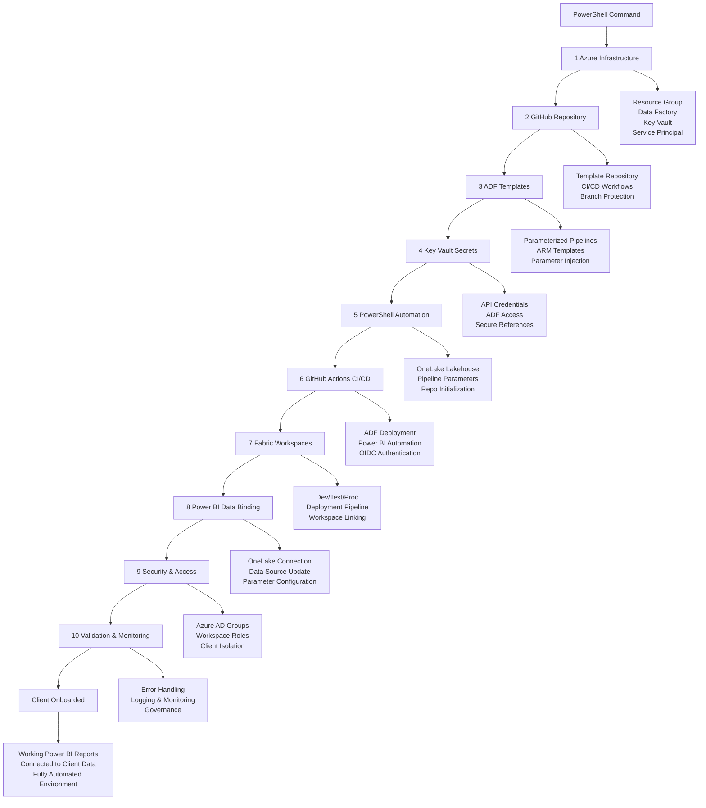

# Fully Automated Client Onboarding Platform

!!! info "One-Click Client Onboarding with Azure, GitHub Actions & Microsoft Fabric"
    This project demonstrates building a **fully automated client onboarding system** that provisions complete data platform environments in minutes. From Azure infrastructure to Power BI reports, everything is automated through PowerShell scripts and GitHub Actions.

## Project Overview

This is a comprehensive **multi-client data platform automation solution** that can onboard new clients with a single PowerShell command. The system automatically provisions Azure infrastructure, creates GitHub repositories from templates, configures Microsoft Fabric workspaces, deploys parameterized data pipelines, and delivers working Power BI reports - all without manual intervention.

### The Vision: One-Command Client Onboarding

```powershell
# This single command provisions everything for a new client:
.\Onboard-Client.ps1 -ClientName "Contoso" -ApiEndpoint "https://api.contoso.com" -GitHubOrg "your-org"

# Result: Complete working data platform in ~10 minutes
# Azure Resource Group with ADF + Key Vault
# GitHub repository with CI/CD workflows
# Microsoft Fabric workspaces (Dev/Test/Prod)
# Parameterized data pipelines deployed
# Power BI reports connected to client data
# Security and access controls configured
```

### Automated Client Onboarding Flow

**Single Command:** `.\Onboard-Client.ps1 -ClientName "Contoso" -ApiEndpoint "https://api.contoso.com"`

**Result:** Complete working data platform in ~10 minutes



### Automation Components

=== "Infrastructure Automation"

    **Azure Resource Provisioning**

    - **PowerShell Scripts**: Automated Azure resource creation
    - **Resource Groups**: Isolated per-client environments
    - **Service Principals**: Automated identity and access management
    - **Key Vault Integration**: Secure credential storage and retrieval

=== "Repository Automation"

    **GitHub Template System**

    - **Template Repositories**: Standardized project structure
    - **Automated Repo Creation**: GitHub API integration
    - **CI/CD Workflows**: Pre-configured GitHub Actions
    - **Branch Protection**: Automated security policies

=== "Fabric Workspace Automation"

    **Microsoft Fabric Provisioning**

    - **Workspace Creation**: Dev/Test/Prod environments via API
    - **Deployment Pipelines**: Automated pipeline linking
    - **OneLake Configuration**: Delta storage setup
    - **Access Control**: Automated role assignments

=== "Data Pipeline Automation"

    **Parameterized Pipeline Deployment**

    - **Template Injection**: Dynamic parameter substitution
    - **ARM Template Deployment**: Infrastructure as Code
    - **Trigger Configuration**: Automated scheduling per client
    - **Connection Management**: Dynamic data source binding

=== "Power BI Automation"

    **Report Deployment & Configuration**

    - **PBIX Template System**: Reusable report templates
    - **Data Source Binding**: Automated connection to client data
    - **Deployment Pipeline Integration**: Dev → Test → Prod promotion
    - **Access Control**: Automated workspace permissions

## Implementation Phases

### Phase 1: Base Infrastructure Automation

**Objectives:**
- Automate Azure resource provisioning
- Implement secure credential management
- Create service principal automation
- Establish OneLake foundation

**Deliverables:**
- **[Azure Infrastructure Automation](AzureDataFactory.md)**: Complete resource provisioning
- PowerShell scripts for resource creation
- Key Vault integration and security
- Service principal configuration

### Phase 2: GitHub Repository Automation

**Objectives:**
- Create template repository system
- Automate repository creation from templates
- Implement CI/CD workflow templates
- Establish branch protection automation

**Deliverables:**
- **[Repository Template System](IngestionPipelines.md)**: Automated repo creation
- GitHub Actions workflow templates
- Branch protection and security policies
- Template injection and customization

### Phase 3: Microsoft Fabric Automation

**Objectives:**
- Automate Fabric workspace creation
- Implement deployment pipeline automation
- Configure OneLake and Lakehouse setup
- Establish automated access control

**Deliverables:**
- **[Fabric Workspace Automation](PowerBI.md)**: Complete workspace provisioning
- Deployment pipeline configuration
- OneLake Delta storage setup
- Automated role and permission management

### Phase 4: End-to-End Integration

**Objectives:**
- Integrate all automation components
- Implement comprehensive error handling
- Create monitoring and logging
- Establish governance and compliance

**Deliverables:**
- **[Complete Automation System](PowerPages.md)**: End-to-end onboarding
- Comprehensive error handling and retry logic
- Monitoring, logging, and alerting
- Governance and compliance automation

## Technology Stack

### Core Technologies

```yaml
Data Platform:
  Ingestion:
    - Azure Data Factory v2
    - Azure Logic Apps
    - Azure Functions (Python/C#)
    - Custom REST APIs

  Storage:
    - Azure Data Lake Storage Gen2
    - Azure SQL Database
    - Azure Cosmos DB
    - Azure Blob Storage

  Processing:
    - Azure Databricks (Spark/Python)
    - Azure Synapse Analytics
    - Microsoft Fabric
    - Azure Stream Analytics

  Presentation:
    - Power BI Premium
    - Power Pages
    - Power Apps
    - Custom Web Applications

Version Control & DevOps:
  Source Control:
    - Git (GitHub)
    - Git LFS for large files
    - Branch policies and protection
    - Pull request workflows

  CI/CD:
    - GitHub Actions
    - GitHub Workflows
    - PowerShell/Azure CLI
    - Terraform/Bicep Templates

  Testing:
    - Unit testing frameworks
    - Integration testing
    - Data quality validation
    - Performance testing

  Monitoring:
    - Azure Monitor
    - Application Insights
    - Power BI monitoring
    - Custom dashboards
```

### Development Tools

```yaml
IDE & Editors:
  - Visual Studio Code
  - Azure Data Studio
  - Power BI Desktop
  - Visual Studio 2022

Extensions & Plugins:
  - Azure Data Factory Tools
  - Power BI Projects (PBIP)
  - Git integration
  - GitHub extension

Command Line Tools:
  - Azure CLI
  - PowerShell Core
  - Git CLI
  - Power BI CLI (fabric)
```

## Version Control Strategy

### Multi-Client Repository Architecture

For secure multi-client environments, use **separate GitHub repositories per client**:

```
Client A Repository (client-a-data-platform):
├── .github/
│   ├── workflows/
│   │   ├── adf-ci-cd.yml
│   │   ├── powerbi-deployment.yml
│   │   └── fabric-sync.yml
│   └── ISSUE_TEMPLATE/
├── adf/
│   ├── pipeline/
│   ├── dataset/
│   ├── linkedService/
│   ├── trigger/
│   └── ARMTemplateForFactory.json
├── powerbi/
│   ├── reports/
│   │   └── client-a-dashboard.pbix
│   ├── datasets/
│   └── deployment/
├── fabric/
│   ├── lakehouse/
│   ├── dataflows/
│   └── notebooks/
├── infrastructure/
│   ├── bicep/
│   │   ├── keyvault.bicep
│   │   ├── storage.bicep
│   │   └── main.bicep
│   └── parameters/
│       ├── dev.parameters.json
│       ├── test.parameters.json
│       └── prod.parameters.json
├── tests/
│   ├── unit/
│   ├── integration/
│   └── data-quality/
├── scripts/
│   ├── pre-deployment.ps1
│   ├── post-deployment.ps1
│   └── utilities/
└── docs/
    ├── client-specific-requirements.md
    └── deployment-guide.md

Client B Repository (client-b-data-platform):
├── [Same structure as Client A]
└── [Client B specific configurations]

Client C Repository (client-c-data-platform):
├── [Same structure as Client A]
└── [Client C specific configurations]
```

### Security and Compliance Benefits

```yaml
Repository Isolation:
  Access Control:
    - Client-specific GitHub team permissions
    - Separate service principals per client
    - Isolated secrets and credentials
    - Independent audit trails

  Compliance:
    - Client-specific Git history
    - Separate compliance reporting
    - Independent security scanning
    - Isolated backup and recovery

  Development:
    - Client-specific feature branches
    - Independent CI/CD pipelines
    - Separate deployment schedules
    - Isolated testing environments
```

### GitHub CI/CD Configuration for Azure Data Factory

Based on Microsoft's official CI/CD guidance, here's how to configure GitHub Actions with ADF:

#### 1. ADF Git Integration Setup

```yaml
ADF Configuration:
  Git Integration:
    - Only DEVELOPMENT factory connects to Git
    - Test and Production factories are Git-free
    - Use collaboration branch (main) for publishing
    - Feature branches for individual development

  Repository Settings:
    - Repository: GitHub (not Azure DevOps)
    - Collaboration branch: main
    - Publish branch: adf_publish (auto-generated)
    - Root folder: /adf/
```

#### 2. GitHub Actions Workflow

```yaml
# .github/workflows/adf-ci-cd.yml
name: ADF CI/CD Pipeline

on:
  push:
    branches: [ main ]
    paths: [ 'adf/**' ]
  pull_request:
    branches: [ main ]
    paths: [ 'adf/**' ]

env:
  AZURE_SUBSCRIPTION_ID: ${{ secrets.AZURE_SUBSCRIPTION_ID }}
  RESOURCE_GROUP_DEV: 'rg-client-a-dev'
  RESOURCE_GROUP_TEST: 'rg-client-a-test'
  RESOURCE_GROUP_PROD: 'rg-client-a-prod'
  ADF_NAME_DEV: 'adf-client-a-dev'
  ADF_NAME_TEST: 'adf-client-a-test'
  ADF_NAME_PROD: 'adf-client-a-prod'

jobs:
  validate:
    runs-on: ubuntu-latest
    steps:
    - uses: actions/checkout@v4

    - name: Azure Login
      uses: azure/login@v1
      with:
        creds: ${{ secrets.AZURE_CREDENTIALS }}

    - name: Validate ADF Resources
      run: |
        # Install ADF utilities
        npm install -g @microsoft/azure-data-factory-utilities

        # Validate all ADF resources
        npx @microsoft/azure-data-factory-utilities validate ./adf/ ${{ env.ADF_NAME_DEV }}

  deploy-test:
    needs: validate
    runs-on: ubuntu-latest
    if: github.ref == 'refs/heads/main'
    environment: test

    steps:
    - uses: actions/checkout@v4

    - name: Azure Login
      uses: azure/login@v1
      with:
        creds: ${{ secrets.AZURE_CREDENTIALS }}

    - name: Pre-deployment Script
      run: |
        # Stop triggers before deployment
        ./scripts/pre-deployment.ps1 -ResourceGroupName ${{ env.RESOURCE_GROUP_TEST }} -DataFactoryName ${{ env.ADF_NAME_TEST }}
      shell: pwsh

    - name: Deploy to Test
      uses: azure/arm-deploy@v1
      with:
        subscriptionId: ${{ env.AZURE_SUBSCRIPTION_ID }}
        resourceGroupName: ${{ env.RESOURCE_GROUP_TEST }}
        template: ./adf/ARMTemplateForFactory.json
        parameters: ./infrastructure/parameters/test.parameters.json

    - name: Post-deployment Script
      run: |
        # Start triggers after deployment
        ./scripts/post-deployment.ps1 -ResourceGroupName ${{ env.RESOURCE_GROUP_TEST }} -DataFactoryName ${{ env.ADF_NAME_TEST }}
      shell: pwsh

  deploy-prod:
    needs: deploy-test
    runs-on: ubuntu-latest
    environment: production

    steps:
    - uses: actions/checkout@v4

    - name: Azure Login
      uses: azure/login@v1
      with:
        creds: ${{ secrets.AZURE_CREDENTIALS }}

    - name: Pre-deployment Script
      run: |
        ./scripts/pre-deployment.ps1 -ResourceGroupName ${{ env.RESOURCE_GROUP_PROD }} -DataFactoryName ${{ env.ADF_NAME_PROD }}
      shell: pwsh

    - name: Deploy to Production
      uses: azure/arm-deploy@v1
      with:
        subscriptionId: ${{ env.AZURE_SUBSCRIPTION_ID }}
        resourceGroupName: ${{ env.RESOURCE_GROUP_PROD }}
        template: ./adf/ARMTemplateForFactory.json
        parameters: ./infrastructure/parameters/prod.parameters.json

    - name: Post-deployment Script
      run: |
        ./scripts/post-deployment.ps1 -ResourceGroupName ${{ env.RESOURCE_GROUP_PROD }} -DataFactoryName ${{ env.ADF_NAME_PROD }}
      shell: pwsh

#### 3. Pre/Post Deployment Scripts

Based on Microsoft's recommendations, use PowerShell scripts to manage triggers:

```powershell
# scripts/pre-deployment.ps1
param(
    [Parameter(Mandatory = $true)]
    [string]$ResourceGroupName,

    [Parameter(Mandatory = $true)]
    [string]$DataFactoryName
)

# Install required modules
Install-Module -Name Az.DataFactory -Force -AllowClobber

# Get all triggers
$triggers = Get-AzDataFactoryV2Trigger -ResourceGroupName $ResourceGroupName -DataFactoryName $DataFactoryName

# Stop all active triggers
foreach ($trigger in $triggers) {
    if ($trigger.RuntimeState -eq "Started") {
        Write-Host "Stopping trigger: $($trigger.Name)"
        Stop-AzDataFactoryV2Trigger -ResourceGroupName $ResourceGroupName -DataFactoryName $DataFactoryName -Name $trigger.Name -Force
    }
}

Write-Host "All triggers stopped successfully"
```

```powershell
# scripts/post-deployment.ps1
param(
    [Parameter(Mandatory = $true)]
    [string]$ResourceGroupName,

    [Parameter(Mandatory = $true)]
    [string]$DataFactoryName
)

# Install required modules
Install-Module -Name Az.DataFactory -Force -AllowClobber

# Get all triggers
$triggers = Get-AzDataFactoryV2Trigger -ResourceGroupName $ResourceGroupName -DataFactoryName $DataFactoryName

# Start triggers that should be active
foreach ($trigger in $triggers) {
    # Only start triggers that were previously active (add logic based on your requirements)
    if ($trigger.Name -like "*monthly*" -or $trigger.Name -like "*client*") {
        Write-Host "Starting trigger: $($trigger.Name)"
        Start-AzDataFactoryV2Trigger -ResourceGroupName $ResourceGroupName -DataFactoryName $DataFactoryName -Name $trigger.Name -Force
    }
}

Write-Host "Triggers started successfully"
```

#### 4. GitHub Repository Secrets Configuration

```yaml
Required Secrets:
  AZURE_CREDENTIALS: |
    {
      "clientId": "service-principal-client-id",
      "clientSecret": "service-principal-secret",
      "subscriptionId": "azure-subscription-id",
      "tenantId": "azure-tenant-id"
    }

  AZURE_SUBSCRIPTION_ID: "your-subscription-id"

  # Client-specific secrets
  CLIENT_A_API_KEY: "client-a-api-key"
  CLIENT_A_CONNECTION_STRING: "client-a-connection-string"
```

#### 5. Branch Protection and Development Workflow

```yaml
Branch Protection Rules (main branch):
  Required Reviews: 2
  Dismiss Stale Reviews: true
  Require Review from Code Owners: true
  Restrict Pushes: true
  Require Status Checks:
    - validate (GitHub Actions)
    - security-scan

Development Workflow:
  1. Developer creates feature branch from main
  2. Makes changes in ADF Studio (connected to feature branch)
  3. Commits and pushes changes to feature branch
  4. Creates pull request to main
  5. Automated validation runs on PR
  6. Code review and approval process
  7. Merge to main triggers deployment pipeline
  8. Automated deployment to Test → Production
```
```

## Development Workflow

### Feature Development Process

1. **Planning and Design**
   ```bash
   # Create feature branch
   git checkout develop
   git pull origin develop
   git checkout -b feature/data-ingestion-enhancement
   ```

2. **Development and Testing**
   ```bash
   # Make changes and commit
   git add .
   git commit -m "feat: add new data source connector"

   # Run local tests
   pytest tests/unit/
   python scripts/data-quality-check.py
   ```

3. **Integration and Review**
   ```bash
   # Push feature branch
   git push origin feature/data-ingestion-enhancement

   # Create pull request (automated via GitHub)
   # - Automated testing via GitHub Actions
   # - Code quality analysis with CodeQL
   # - Security scanning with Dependabot
   # - Peer review process
   ```

4. **Deployment and Validation**
   ```bash
   # Merge triggers automated deployment
   # - Development environment deployment
   # - Integration testing
   # - Staging environment deployment
   # - Production deployment (with approval)
   ```

### Quality Gates and Governance

```yaml
Automated Quality Checks:
  Code Quality:
    - SonarQube analysis
    - Code coverage requirements (>80%)
    - Security vulnerability scanning
    - Dependency vulnerability checks

  Data Quality:
    - Schema validation
    - Data profiling
    - Referential integrity checks
    - Business rule validation

  Performance:
    - Pipeline execution time limits
    - Resource utilization monitoring
    - Query performance analysis
    - Scalability testing

  Compliance:
    - Data privacy compliance (GDPR)
    - Security policy enforcement
    - Audit trail maintenance
    - Documentation requirements
```

## Success Metrics and KPIs

### Technical Metrics

```yaml
Development Velocity:
  - Lead time for changes: <2 weeks
  - Deployment frequency: Daily
  - Mean time to recovery: <4 hours
  - Change failure rate: <5%

Quality Metrics:
  - Code coverage: >80%
  - Bug escape rate: <2%
  - Data quality score: >95%
  - Pipeline success rate: >99%

Performance Metrics:
  - Data freshness: <1 hour
  - Query response time: <5 seconds
  - Pipeline execution time: Baseline +/- 10%
  - System availability: >99.9%
```

### Business Metrics

```yaml
User Adoption:
  - Active report users: Growth >20% quarterly
  - Self-service analytics adoption: >60%
  - Citizen developer engagement: >50 active users
  - Training completion rate: >90%

Business Value:
  - Time to insight: <1 day
  - Decision-making speed: 50% improvement
  - Data-driven decisions: >80%
  - Cost per insight: 30% reduction
```

## Getting Started

### Prerequisites

**Technical Requirements:**
- Azure subscription with appropriate permissions
- GitHub account with Actions enabled
- Power BI Premium or Fabric capacity
- Development environment setup

**Skills and Knowledge:**
- Git version control fundamentals
- Azure services familiarity
- SQL and data modeling
- PowerShell or Python scripting
- CI/CD pipeline concepts

### Quick Start Guide

1. **Clone the Repository**
   ```bash
   git clone https://github.com/your-org/data-platform-project.git
   cd data-platform-project
   ```

2. **Set Up Development Environment**
   ```bash
   # Install required tools
   ./scripts/setup-dev-environment.ps1

   # Configure Azure CLI
   az login
   az account set --subscription "your-subscription-id"
   ```

3. **Deploy Infrastructure**
   ```bash
   # Deploy base infrastructure
   cd infrastructure/terraform
   terraform init
   terraform plan
   terraform apply
   ```

4. **Configure Services**
   ```bash
   # Set up Azure Data Factory
   ./scripts/deploy-adf.ps1 -Environment "dev"

   # Configure Power BI workspace
   ./scripts/setup-powerbi-workspace.ps1
   ```

## Next Steps

This project provides a comprehensive foundation for enterprise data platform development with modern version control practices. Each component builds upon the previous one, creating a cohesive and scalable solution.

**Recommended Learning Path:**
1. **[Azure Data Factory CI/CD](AzureDataFactory.md)** - Start with data ingestion pipelines
2. **[Data Ingestion Pipelines](IngestionPipelines.md)** - Advanced ingestion patterns
3. **[Power BI Version Control](PowerBI.md)** - Business intelligence development
4. **[Power Pages Integration](PowerPages.md)** - Low-code application development

!!! tip "Enterprise Implementation"
    This project is designed for enterprise environments but can be scaled down for smaller organizations. Start with the components most relevant to your immediate needs and expand gradually.
