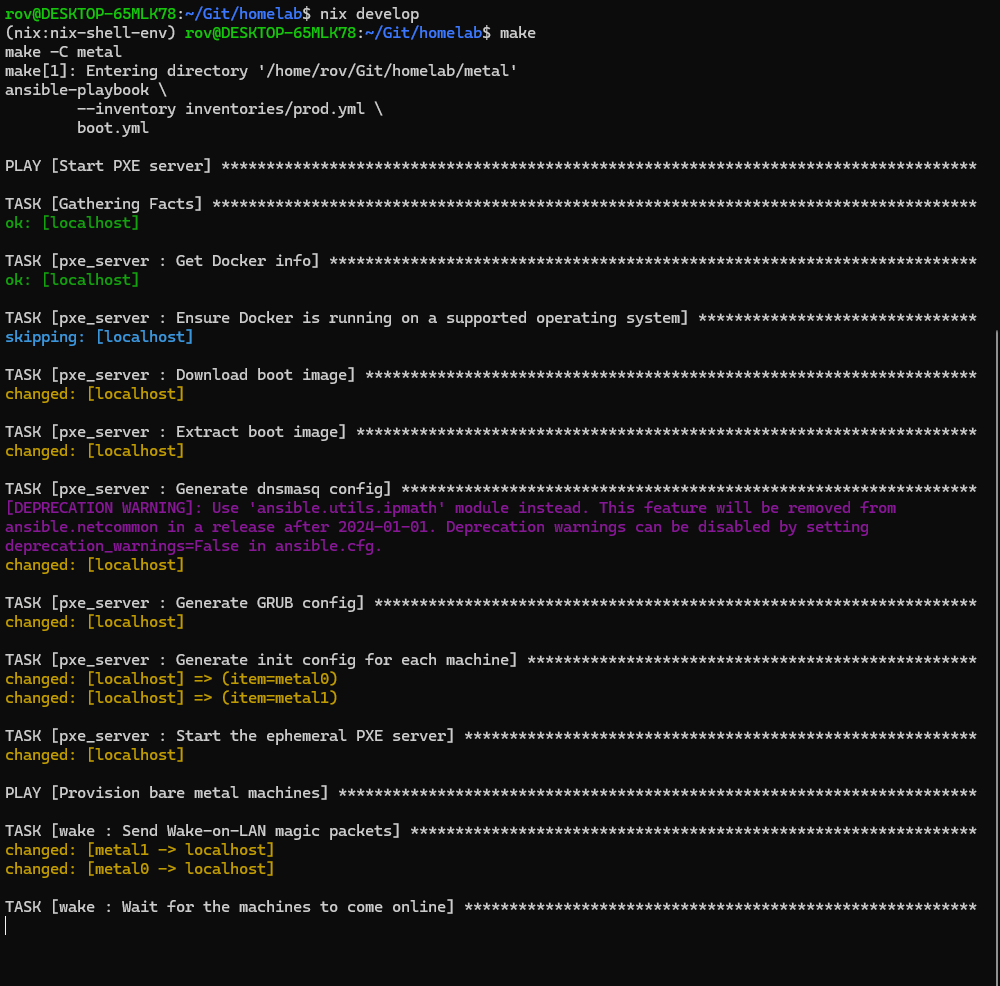

# Homelab Configuration Night 2: Hardware Setup and Discovery

This document chronicles the second night of home lab setup, focusing on physical hardware preparation, BIOS configuration, and system discovery for the Kubernetes cluster nodes.

!!! info "Session Overview"
    **Goal**: Configure physical hardware and discover system specifications
    **Hardware**: Dell OptiPlex 7050 micro form factor desktops
    **Duration**: Evening session focused on hands-on hardware work

## Hardware Foundation: Dell OptiPlex 7050 Analysis

### Why Dell OptiPlex 7050?

Each unit is a Dell OptiPlex 7050 acquired from a local business upgrading their infrastructure. These micro form factor desktops represent an excellent balance for home lab use.

**Advantages of Micro Form Factor Desktops:**
- **Compact footprint**: Minimal rack/shelf space requirements
- **Quiet operation**: Better cooling design than stacked laptops
- **Adequate performance**: Sufficient CPU/RAM for Kubernetes workloads
- **Standardised hardware**: Consistent specifications across units
- **Business-grade reliability**: Enterprise components and build quality

!!! warning "Future Hardware Availability"
    The trend toward laptop-only business environments may impact the availability of quality micro desktops for home labbers. Consider acquiring units while they're still available from business upgrades.

## Node Configuration Details

### metal0 (Primary Control Plane)
- **IP Address:** `192.168.1.190`
- **MAC Address:** `D8:9E:F3:90:E8:31`
- **Secure Boot:** Disabled (required for Linux installation)
- **Wake on LAN:** Enabled for LAN (remote power management)
- **Network Interface:** `enp0s31f6` (Dell-specific PCIe naming)
- **Storage Device:** `nvme0n1` (NVMe SSD primary storage)
- **Role:** Kubernetes control plane node

### metal1 (Secondary Control Plane)
- **IP Address:** `192.168.1.191`
- **MAC Address:** `D8:9E:F3:10:E8:A8`
- **Secure Boot:** Disabled
- **Wake on LAN:** Enabled for LAN
- **Network Interface:** `enp0s31f6`
- **Storage Device:** `nvme0n1`
- **Role:** Kubernetes control plane node (HA)

### metal2 (Worker Node)
- **IP Address:** `192.168.1.192`
- **MAC Address:** `D8:9E:F3:90:DD-2B`
- **Secure Boot:** Disabled
- **Wake on LAN:** Enabled for LAN
- **Network Interface:** `enp0s31f6`
- **Storage Device:** `nvme0n1`
- **Role:** Kubernetes worker node

### metal3 (Worker Node)
- **IP Address:** `192.168.1.193`
- **MAC Address:** `D8:9E:F3:90:E9:54`
- **Secure Boot:** Disabled
- **Wake on LAN:** Enabled for LAN
- **Network Interface:** `enp0s31f6`
- **Storage Device:** `nvme0n1`
- **Role:** Kubernetes worker node

!!! note "Hardware Consistency"
    **Standardised Configuration:**
    - All units share identical network interface naming (`enp0s31f6`)
    - Consistent NVMe storage device naming (`nvme0n1`)
    - Uniform BIOS settings across all nodes
    - Sequential IP addressing for easy management


## Hardware Discovery Process

### The Challenge: Device Naming Discovery

The most challenging aspect was determining the correct network and storage device names. Dell's BIOS provides minimal information about Linux device naming conventions, requiring a hands-on discovery approach.

**Initial Approach (Unsuccessful):**
- Attempted to gather information during Ubuntu installation process
- Installation screens didn't provide sufficient detail for automation needs

### Successful Discovery Method

**Complete Ubuntu installation and system interrogation:**

!!! tip "Hardware Discovery Strategy"
    When BIOS information is insufficient, a full OS installation provides the most reliable method for discovering Linux device names and system specifications.

**Storage Device Discovery:**
```bash
# List all block devices with hierarchy
lsblk

# Output shows:
# - Device names (nvme0n1, sda, etc.)
# - Partition layout
# - Mount points
# - Device sizes and types
```

**Network Interface Discovery:**
```bash
# Display all network interfaces
ip link show

# Alternative command for detailed information
ip addr show
```

**Example output for metal0:**
- **Network Interface:** `enp0s31f6`
- **Naming Convention:** PCIe-based predictable network interface names
- **Dell Specifics:** Unique to Dell's hardware implementation

!!! info "Linux Network Interface Naming"
    **Modern Predictable Names:**
    - `enp0s31f6` breaks down as:
      - `en` = Ethernet
      - `p0` = PCI bus 0
      - `s31` = Slot 31
      - `f6` = Function 6

    This naming ensures consistent interface names across reboots and hardware changes.

## Storage Configuration Requirements

### BIOS Storage Settings

**Critical Discovery: RAID vs AHCI Configuration**

During the hardware setup process, it became apparent that additional BIOS configuration was required for proper Linux storage support.

**Required BIOS Changes:**
1. **Disable RAID Mode**: Dell OptiPlex units default to RAID/Intel RST mode
2. **Enable AHCI Mode**: Required for proper NVMe and SATA device recognition
3. **Verify Storage Detection**: Ensure all storage devices are visible

!!! warning "Storage Mode Impact"
    **RAID Mode Issues:**
    - Linux may not detect NVMe devices properly
    - Requires additional drivers or kernel modules
    - Can cause installation failures

    **AHCI Mode Benefits:**
    - Native Linux support for all storage devices
    - Better performance for single-drive configurations
    - Simplified driver requirements

**BIOS Configuration Steps:**
1. Enter BIOS setup (F2 during boot)
2. Navigate to Storage or Drive Configuration
3. Change from "RAID On" to "AHCI"
4. Save settings and exit
5. Verify storage devices are detected correctly

!!! tip "BIOS Configuration Best Practices"
    - **Document settings**: Take photos of BIOS screens for reference
    - **Consistent configuration**: Apply identical settings across all nodes
    - **Test before deployment**: Verify storage detection after changes
    - **Backup settings**: Some BIOS versions allow configuration export

## Development Environment: Docker Installation

### Docker Setup in WSL Environment

Returning to the development PC, Docker installation was required within the WSL environment to support container-based tooling and testing.

### Docker Installation Process

**Step 1: Configure Docker APT Repository**
```bash
# Update package index and install prerequisites
sudo apt-get update
sudo apt-get install ca-certificates curl

# Create keyrings directory for GPG keys
sudo install -m 0755 -d /etc/apt/keyrings

# Download and install Docker's official GPG key
sudo curl -fsSL https://download.docker.com/linux/ubuntu/gpg -o /etc/apt/keyrings/docker.asc
sudo chmod a+r /etc/apt/keyrings/docker.asc

# Add Docker repository to APT sources
echo \
  "deb [arch=$(dpkg --print-architecture) signed-by=/etc/apt/keyrings/docker.asc] https://download.docker.com/linux/ubuntu \
  $(. /etc/os-release && echo "${UBUNTU_CODENAME:-$VERSION_CODENAME}") stable" | \
  sudo tee /etc/apt/sources.list.d/docker.list > /dev/null

# Update package index with Docker repository
sudo apt-get update
```

**Step 2: Install Docker Components**
```bash
# Install Docker Engine and related components
sudo apt-get install docker-ce docker-ce-cli containerd.io docker-buildx-plugin docker-compose-plugin
```

!!! info "Docker Components Explained"
    - **docker-ce**: Docker Community Edition engine
    - **docker-ce-cli**: Command-line interface tools
    - **containerd.io**: Container runtime
    - **docker-buildx-plugin**: Extended build capabilities
    - **docker-compose-plugin**: Multi-container application management

**Step 3: User Permission Configuration**
```bash
# Add current user to docker group (avoids sudo requirement)
sudo usermod -aG docker $USER

# Apply group membership changes
# Option 1: Start new WSL session
# Option 2: Use newgrp command
newgrp docker
```

!!! warning "Group Membership Security"
    Adding users to the `docker` group grants root-equivalent access to the system. Only add trusted users to this group, as Docker containers can access the host filesystem and resources.


### Development Environment Validation

**Return to Nix Development Environment:**
```bash
# Activate the development shell with all tools
nix develop

# Execute the build/deployment process
make
```

!!! success "Development Environment Ready"
    With Docker installed and user permissions configured, the development environment now supports:

    - **Container building**: Local testing of Kubernetes manifests
    - **Development workflows**: Full toolchain available in Nix shell
    - **Integration testing**: Ability to test configurations locally
    - **CI/CD preparation**: Foundation for automated deployment pipelines

## Session Results and Validation

### Build Process Execution

The culmination of Night 2's work was successfully executing the build process, validating that all components were properly configured and integrated.

**Build Output Analysis:**


!!! tip "Build Process Verification"
    The successful `make` execution confirms:

    - **Nix environment**: All development tools properly installed
    - **Docker integration**: Container runtime accessible from development shell
    - **Configuration validity**: Ansible inventory and Terraform configurations parsed correctly
    - **Dependency resolution**: All required packages and tools available

## Session Summary and Achievements

### Hardware Configuration Completed

**Physical Setup:**
- Four Dell OptiPlex 7050 units configured and documented
- BIOS settings standardised across all nodes
- Wake-on-LAN enabled for remote management
- Storage configuration optimised for Linux

**System Discovery:**
- Network interface names identified (`enp0s31f6`)
- Storage device names confirmed (`nvme0n1`)
- MAC addresses collected for all units
- IP address assignments documented

**Development Environment:**
- Docker installed and configured in WSL
- User permissions properly set
- Integration with Nix development shell verified
- Build process successfully executed

### Key Technical Insights

**Hardware Standardisation Benefits:**
- Consistent device naming simplifies automation
- Identical BIOS settings reduce configuration drift
- Standardised hardware reduces troubleshooting complexity

**Discovery Process Lessons:**
- BIOS information insufficient for Linux device naming
- Full OS installation required for accurate device discovery
- Documentation during discovery process saves future time

**Development Environment Integration:**
- WSL provides excellent Linux tooling on Windows
- Docker integration enables local testing capabilities
- Nix ensures reproducible development environments

### Next Steps and Future Sessions

**Immediate Next Actions:**
1. **OS Installation**: Deploy Ubuntu Server on all nodes
2. **Network Configuration**: Configure static IP addresses
3. **SSH Setup**: Enable key-based authentication
4. **Ansible Preparation**: Update inventory with discovered hardware details

**Future Session Planning:**
- **Night 3**: Ubuntu Server installation and basic configuration
- **Night 4**: Kubernetes cluster initialisation
- **Night 5**: Application deployment and testing

!!! success "Progress Assessment"
    Night 2 successfully completed the hardware foundation phase. All physical nodes are configured and ready for OS installation, with development environment fully prepared for the next phase of deployment.
